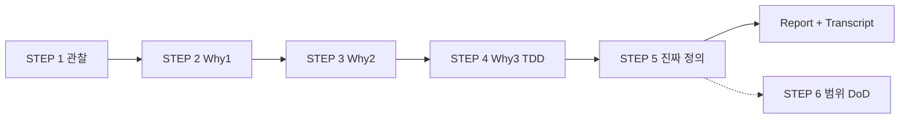

# Magic Square XX — 대화형 프롬프트 Transcript Export

**Export 일시:** 2026-05-28  
**프로젝트:** Magic_Square_XX  
**용도:** 동일한 문제 정의 워크플로를 다른 세션·에이전트에서 **대화형으로 재현**하기 위한 프롬프트 모음  
**범위:** 사용자 프롬프트 전체 + 단계별 기대 산출물 (어시스턴트 응답 요약은 Report 참조)

---

## 사용 방법

1. 아래 **MASTER** 또는 단계별 블록을 새 채팅에 순서대로 붙여 넣는다.
2. 각 STEP 완료 후, **STOP 조건**을 만족할 때까지 다음 STEP으로 넘기지 않는다.
3. 최종 산출물은 `Report/Magic_Square_Problem_Definition_Report.md`와 동일 구조를 목표로 한다.

### 글로벌 제약 (모든 STEP에 공통)

에이전트에게 항상 다음을 명시한다:

```
- 구현 설계를 하지 마십시오.
- 코드를 언급하지 마십시오.
- 알고리즘을 설명하지 마십시오.
- "마방진을 만든다"는 표현 대신, 상황·규칙·판정 관점으로 서술하십시오.
```

---

## MASTER — 전체 워크플로 (한 번에 위임)

```markdown
당신은 문제 정의 전문가입니다.
나는 4x4 Magic Square 프로그램을 만들려고 합니다.
하지만 바로 설계하거나 구현하지 마십시오.
문제 인식 단계부터 STEP 5까지 순서대로 진행하십시오.

[공통 제약]
- 구현 설계 금지
- 코드 언급 금지
- 알고리즘 설명 금지
- 구조화된 Markdown으로 작성

각 STEP이 끝나면 다음 STEP으로 넘어가기 전에
해당 STEP의 핵심 발견을 3~5줄로 요약하고 확인을 요청하십시오.
```

이후 **STEP 1 ~ STEP 5** 개별 프롬프트를 순차 적용한다.

---

## Transcript — 사용자 프롬프트 원문

### Turn 0 — 프로젝트 컨텍스트 (시스템·규칙에서 유추)

- OS: Windows  
- 워크스페이스: `Magic_Square_XX` (초기 빈 저장소)  
- 사용자 규칙: 유능한 파이썬 개발자 맥락 (문제 정의 단계에서는 구현 미요청)

---

### Turn 1 — STEP 1: Observation

```markdown
당신은 문제 정의 전문가입니다.
나는 4x4 Magic Square 프로그램을 만들려고 합니다.
하지만 바로 설계하거나 구현하지 마십시오.
먼저 문제 인식 단계부터 진행하십시오.
--------------------------------------------
STEP 1 — Observation (관찰)
--------------------------------------------
다음 질문에 답하십시오:
1. 현재 우리가 해결하려는 상황은 무엇인가?
2. 왜 4x4 마방진 문제를 다루는가?
3. 이 문제는 어떤 학습 또는 시스템 설계 맥락에서 등장하는가?
“마방진을 만든다”는 표현 대신,상황을 관찰 관점으로 서술하십시오.
```

**기대 산출물**

- 빈 프로젝트·4×4 고정·프로그램 의도 관찰
- 규모·검증 용이성·교육 맥락
- 학습 vs 설계 맥락 표
- 관찰 한 줄 요약

**STOP 조건:** 구현·설계·코드 없음

---

### Turn 2 — STEP 2: Why #1

```markdown
--------------------------------------------
STEP 2 — Why #1
--------------------------------------------
Q: 왜 마방진을 완성해야 하는가?
A를 가정하여 답하고, 그 답에서 드러나는 불편함 또는 구조적 문제를 분석하십시오.
```

**기대 산출물**

- 가정 A: 유효 배치 확보 + 검증 (과제/자기확인 등)
- 긴장: 완료 정의, 동기, 4×4 동형, 검증만으로 충족, 일회성, 실패 부재
- Why #1 결론 한 줄

**STOP 조건:** 구현·설계·코드 없음

---

### Turn 3 — STEP 3: Why #2

```markdown
--------------------------------------------
STEP 3 — Why #2
--------------------------------------------
Q: 왜 단순 계산이 아니라 프로그램으로 구현하는가?
다음 관점에서 답하십시오:
- 반복 가능성
- 검증 자동화
- 오류 방지
- 규칙 기반 사고 훈련
```

**기대 산출물**

- 가정 A′ 한 줄
- 네 관점 각각: 이유 + 구조적 긴장
- Why #1(손가능) vs Why #2(프로그램 정당화) 통합
- 최소 구현 = 검증기로 수렴 가능성 명시

**STOP 조건:** 구현·설계·코드 없음

---

### Turn 4 — STEP 4: Why #3 (TDD)

```markdown
--------------------------------------------
STEP 4 — Why #3 (핵심 발견)
--------------------------------------------
Q: 왜 이 문제를 TDD 방식으로 설계하려 하는가?
- 무엇이 통제되어야 하는가?
- 어떤 불변 조건이 존재하는가?
- 왜 입력/출력이 명확해야 하는가?
```

**기대 산출물**

- 가정 A″: 테스트 = 실행 가능한 명세
- 통제 3층: 문제 정의, 책임 경계, 회귀/확장
- 불변: 전역 I1~I5, 행위 V, 선택 O (개념명만, 코드 없음)
- IO 명확성: 계약, 오류 분리, 픽스처, DoD 연결
- 열린 결정 4항목

**STOP 조건:** 구현·설계·코드 없음

---

### Turn 5 — STEP 5: 진짜 문제 정의

```markdown
--------------------------------------------
STEP 5 — 진짜 문제 정의
--------------------------------------------
다음을 작성하십시오:
1. 표면 문제 정의 (잘못된 정의)
2. 개선된 문제 정의 (정확한 정의)
3. 이 문제의 핵심 Invariant
4. 우리가 실제로 훈련하려는 사고 능력
−	구현 설계는 하지 마십시오.
−	코드 언급 금지.
−	알고리즘 설명 금지.
−	구조화된 Markdown으로 작성하십시오.
```

**기대 산출물**

- 표면 vs 개선 정의 대비표
- C1~C5, V1~V3 (+ 선택 O1~O2)
- 사고 능력 7항 + “훈련하지 않는 것”
- 진짜 문제 한 문장
- 체크리스트

**STOP 조건:** 코드·알고리즘·구현 설계 없음

---

### Turn 6 — 산출물 Export (본 요청)

```markdown
다음의 순서로 실행해줘
1. Report 폴더에 보고서 생성해줘
2. 현재까지의 프롬프트 전체를 대화형 프롬프트로 Prompt 폴더에 Export transcript 해줘
```

**기대 산출물**

- `Report/Magic_Square_Problem_Definition_Report.md`
- `Prompt/Magic_Square_Interactive_Prompt_Transcript.md` (본 파일)

---

## 대화형 재실행 스크립트 (복사용)

아래는 **한 STEP씩** 진행할 때 에이전트에게 줄 **연속 지시** 템플릿이다.

```
[STEP N 시작]
이전 STEP 요약을 3줄 이내로 인용한 뒤, STEP N만 수행하라.
공통 제약: 구현·코드·알고리즘 금지.
완료 시 "STEP N 완료"와 핵심 발견 3줄을 출력하고 멈춰라.
```

| STEP | 트리거 문장 |
|------|-------------|
| 1 | `STEP 1 Observation만 진행` + Turn 1 본문 |
| 2 | `STEP 2 Why #1만 진행` + Turn 2 본문 |
| 3 | `STEP 3 Why #2만 진행` + Turn 3 본문 |
| 4 | `STEP 4 Why #3만 진행` + Turn 4 본문 |
| 5 | `STEP 5 진짜 문제 정의만 진행` + Turn 5 본문 |
| 6 | `Report와 Prompt transcript 생성` + Turn 6 본문 |

---

## STEP 6+ 제안 프롬프트 (미실행 — 확장용)

문제 정의 다음 단계용. **아직 대화에서 실행되지 않음.**

```markdown
--------------------------------------------
STEP 6 — 범위 및 완료 정의 (구현 전)
--------------------------------------------
STEP 5 결과를 전제로 다음을 작성하십시오.
1. In Scope / Out of Scope
2. Definition of Done (검증기 우선 vs 생성 포함 두 시나리오)
3. 고정할 유효·무효 사례 목록 (각각 최소 3개, 설명만)
구현·코드·알고리즘 금지. Markdown으로 작성.
```

```markdown
--------------------------------------------
STEP 7 — IO 계약 초안 (구현 전)
--------------------------------------------
STEP 5~6을 전제로:
1. 입력 전제 (형식·도메인·비대상 입력)
2. 출력 약속 (성공·실패·진단 수준)
3. 각 출력이 검증하는 Invariant (C/V) 매핑表
구현·코드·알고리즘 금지.
```

---

## 프롬프트 체인 다이어그램



---

## 관련 파일

| 경로 | 설명 |
|------|------|
| `Report/Magic_Square_Problem_Definition_Report.md` | STEP 1~5 통합 보고서 |
| `Prompt/Magic_Square_Interactive_Prompt_Transcript.md` | 본 transcript |

---

## Export 메타

| 항목 | 값 |
|------|-----|
| 총 사용자 Turn (문제 정의) | 5 |
| Export·보고서 Turn | 1 |
| 제안 확장 Turn | 2 (STEP 6~7) |
| 언어 | 한국어 |
| 제약 | 구현·코드·알고리즘 금지 (STEP 1~5) |
