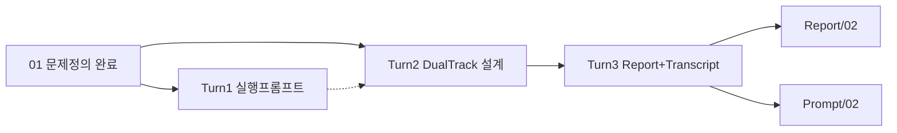

# Magic Square XX — TDD·Clean Architecture 대화형 프롬프트 Transcript Export

**Export 일시:** 2026-05-28  
**프로젝트:** Magic_Square_XX  
**용도:** Dual-Track UI + Logic TDD 설계 워크플로를 다른 세션·에이전트에서 **대화형으로 재현**  
**범위:** 사용자 프롬프트 전체 + 단계별 기대 산출물 (어시스턴트 응답 요약은 Report 참조)  
**선행:** `Report/01.Magic_Square_Problem_Definition_Report.md` 완료 권장

---

## 사용 방법

1. **Turn 1**은 선택: TDD 설계 **실행용 프롬프트**만 필요하면 Turn 1만 사용.
2. **Turn 2**는 Dual-Track·Clean Architecture **설계 본문** 생성용(권장 메인).
3. **Turn 3**으로 Report·본 Transcript Export.
4. 각 STEP/단계 완료 후 **STOP**을 만족할 때까지 다음으로 넘기지 않는다.
5. 최종 설계 산출물: `Report/02.Magic_Square_TDD_Clean_Architecture_Design_Report.md`

### 글로벌 제약 (Turn 2·설계 단계 공통)

```
- 구현 코드(프로덕션·테스트 파일) 작성 금지
- UI는 실제 화면이 아니라 입출력 Boundary
- Data는 DB가 아니라 save/load 인터페이스(메모리/파일 교체)
- 입력/출력 계약은 사용자 지정안 그대로 고정
- 모호어(적절히/충분히) 금지; 모든 규칙은 테스트로 검증 가능해야 함
- 마방진 생성 알고리즘·구성 절차 설명 금지(판정·조합 시도 수준만)
```

---

## Transcript — 사용자 프롬프트 원문

### Turn 0 — 프로젝트 컨텍스트

- 워크스페이스: `Magic_Square_XX`
- 완료: `Report/01.*` 문제 정의 (STEP 1~5)
- 목표: TDD 설계 문서·Dual-Track 레이어 설계 (구현 전)

---

### Turn 1 — TDD 설계 **실행용 프롬프트** 요청 (설계 문서 본문 작성 금지)

```markdown
너는 Cursor.AI용 프롬프트 설계자다.
나는 Magic Square 4x4 TDD 설계 문서를 만들기 위한 프롬프트가 필요하다.
지금 설계 문서를 만들지 말고, 그 설계 문서를 만들 수 있는 실행용 프롬프트만 작성하라.
```

**기대 산출물**

- MASTER + STEP 1~8 실행 프롬프트
- STOP 조건·품질 게이트
- 최종 파일 경로: `Report/02.*` (STEP 8)
- **설계 문서 본문은 이번 Turn에서 작성하지 않음**

**STOP 조건:** 실행 프롬프트만; Report 파일 미생성

---

### Turn 1 — 어시스턴트 산출 요약 (재현 시 참고)

Turn 1 결과물은 **아래 MASTER·STEP 블록**으로 재현한다. (원문은 이 Transcript §「Turn 1 실행 프롬프트 전문」 참조)

---

### Turn 2 — Dual-Track UI + Logic TDD · Clean Architecture 설계

```markdown
당신은 Dual-Track UI + Logic TDD 및 Clean Architecture 설계 전문가입니다.
프로젝트: Magic Square (4x4) — TDD 연습용
목적: 알고리즘 난이도보다 “레이어 분리 + 계약 기반 테스트 + 리팩토링” 훈련
제약:
- 구현 코드는 작성하지 마십시오. (설계/계약/테스트/통합 계획만)
- UI는 실제 화면이 아니라 “입력/출력 경계(Boundary)”로 정의
- Data Layer는 DB가 아니라 “저장/로드 인터페이스(메모리/파일 교체 가능)” 수준만
- 입력/출력은 명확히 고정
입력 계약:
- 4x4 int[][] (0은 빈칸)
- 빈칸은 정확히 2개
- 값 범위: 0 또는 1~16
- 0 제외 중복 금지
출력 계약:
- int[6]
- 좌표는 1-index
- 반환 형식: [r1,c1,n1,r2,c2,n2]
- n1,n2는 두 누락 숫자이며, (작은수→첫빈칸, 큰수→둘째빈칸) 조합이 마방진이면 그 순서로, 아니면 반대로

------------------------------------------------------------
출력 형식 (반드시 이 구조로)
------------------------------------------------------------
# 1) Logic Layer (Domain Layer) 설계
## 1.1 도메인 개념
## 1.2 도메인 불변조건(Invariants)
## 1.3 핵심 유스케이스(도메인 관점)
## 1.4 Domain API(내부 계약)
## 1.5 Domain 단위 테스트 설계(RED 우선)

# 2) Screen Layer (UI Layer) 설계 (Boundary Layer)
## 2.1 사용자/호출자 관점 시나리오
## 2.2 UI 계약(외부 계약)
## 2.3 UI 레벨 테스트(Contract-first, RED 우선)
## 2.4 UX/출력 규칙

# 3) Data Layer 설계
## 3.1 목적 정의
## 3.2 인터페이스 계약
## 3.3 구현 옵션 비교(메모리/파일)
## 3.4 Data 레이어 테스트

# 4) Integration & Verification
## 4.1 통합 경로 정의
## 4.2 통합 테스트 시나리오
## 4.3 회귀 보호 규칙
## 4.4 커버리지 목표
## 4.5 Traceability Matrix (필수)

------------------------------------------------------------
추가 조건
------------------------------------------------------------
- 모호한 표현 금지(“적절히/충분히” 금지)
- 모든 규칙은 검증 가능해야 함(테스트로 확인 가능)
- 구현 코드 작성 금지
- 표/체크리스트를 적극 사용
```

**기대 산출물**

- §1~§4 전체 구조의 설계 본문(채팅 또는 Report 초안)
- DT-*, UT-*, IT-*, IT-DATA-* 테스트 ID
- Traceability Matrix 포함
- 구현 코드·`.py` 파일 없음

**STOP 조건:** Turn 3 Export 전까지 Report 파일은 선택(채팅만 가능)

---

### Turn 3 — 산출물 Export (본 요청)

```markdown
다음의 순서로 실행해줘
1. Report 폴더에 보고서 생성해줘
2. 현재까지의 프롬프트 전체를 대화형 프롬프트로 Prompt 폴더에 Export transcript 해줘
```

**기대 산출물**

- `Report/02.Magic_Square_TDD_Clean_Architecture_Design_Report.md`
- `Prompt/02.Magic_Square_TDD_Design_Interactive_Prompt_Transcript.md` (본 파일)

---

## Turn 1 실행 프롬프트 전문 (STEP 8 → Report/02 경로)

> Turn 1에서 요청한 **문서 생성용** 프롬프트. Turn 2와 병행 시 Turn 2가 우선(입출력 계약이 더 구체적).

### MASTER

```markdown
당신은 TDD 설계 전문가이며, Cursor에서 실행되는 문서 작성 에이전트입니다.

## 임무
4×4 Magic Square 프로젝트의 TDD 설계 문서를 작성하십시오.
이번 세션에서는 설계 문서만 작성합니다. 구현·테스트 코드 파일·실행은 하지 않습니다.

## 필수 선행 입력
- Report/01.Magic_Square_Problem_Definition_Report.md
- README.md

## 공통 제약
- 프로덕션·테스트 코드 파일 생성 금지
- 마방진 생성 알고리즘 설명 금지
- C1~C5, V1~V3 중심; 열린 결정은 가정 A*로 명시

## 작업 방식
STEP 1→8 순서, 각 STEP 후 STOP(사용자 "다음" 시에만 진행)

## 최종 산출물
Report/02.Magic_Square_TDD_Design_Report.md (목차: 목적, 가정, In/Out, DoD, IO, 픽스처, 매핑, 계층, GWT, RGR 로드맵, 회귀, 체크리스트)

지금 STEP 1만 수행하십시오.
```

### STEP 1~8 (요약 트리거)

| STEP | 트리거 |
|------|--------|
| 1 | 선행 문서 동기화·TDD 목표 |
| 2 | 열린 결정 → 가정 표 |
| 3 | In/Out · DoD |
| 4 | IO 계약·오류 3분류 |
| 5 | 픽스처 카탈로그 |
| 6 | Invariant 매핑·테스트 계층 |
| 7 | Red→Green→Refactor 로드맵 |
| 8 | 통합·Report/02 저장 |

공통 tail: `프로덕션 코드·테스트 파일·알고리즘 금지. "STEP N 완료" 후 STOP.`

---

## 대화형 재실행 스크립트 (복사용)

| Turn | 트리거 문장 |
|------|-------------|
| 1 | `Turn 1만: TDD 설계 실행용 프롬프트만 작성. 설계 문서 본문 금지.` |
| 2 | `Turn 2만:` + Turn 2 본문 전체 |
| 3 | `Report/02 생성 + Prompt/02 transcript Export` + Turn 3 본문 |

STEP별( Turn 1 경로 ):

```
[STEP N 시작]
이전 STEP 요약 3줄 인용 후 STEP N만 수행.
공통 제약 적용. 완료 시 "STEP N 완료" 후 STOP.
```

---

## 프롬프트 체인 다이어그램



---

## 관련 파일

| 경로 | 설명 |
|------|------|
| `Report/01.Magic_Square_Problem_Definition_Report.md` | 문제 정의 (선행) |
| `Report/02.Magic_Square_TDD_Clean_Architecture_Design_Report.md` | Dual-Track TDD·CA 설계 통합 |
| `Prompt/01.Magic_Square_Interactive_Prompt_Transcript.md` | 문제 정의 재실행 |
| `Prompt/02.Magic_Square_TDD_Design_Interactive_Prompt_Transcript.md` | 본 transcript |

---

## Export 메타

| 항목 | 값 |
|------|-----|
| 사용자 Turn (TDD·설계) | 3 (Turn 1~3) |
| Turn 1 산출 | 실행 프롬프트 MASTER+STEP 1~8 |
| Turn 2 산출 | §1~§4 설계 본문 |
| Turn 3 산출 | Report/02 + Prompt/02 |
| 언어 | 한국어 |
| 제약 | 구현·테스트 파일 금지 |
