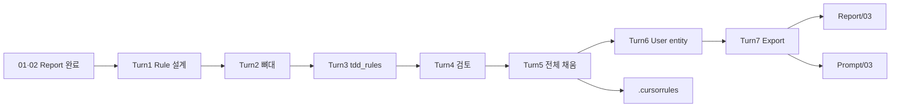

# Magic Square XX — Cursor Rules · 초기 구현 대화형 프롬프트 Transcript Export

**Export 일시:** 2026-05-28  
**프로젝트:** Magic_Square_XX  
**용도:** Cursor Rules 설계·`.cursorrules` 작성·User 엔티티 구현 워크플로를 다른 세션·에이전트에서 **대화형으로 재현**  
**범위:** 사용자 프롬프트 전체 + 단계별 기대 산출물 (어시스턴트 응답 요약은 Report/03 참조)  
**선행:** `Report/01.*`, `Report/02.*` 완료 권장

---

## 사용 방법

1. **Turn 1** — Rule 설계만 필요 시: 구조·`.mdc` vs `.cursorrules` 설명만 요청 (파일 생성 금지).
2. **Turn 2~4** — `.cursorrules` 뼈대 → `tdd_rules`만 → (선택) 검토만.
3. **Turn 5** — 8섹션 전체 채움 (섹션별 작성 규칙 포함).
4. **Turn 6** — User 엔티티 + pytest (ECB entity).
5. **Turn 7** — Report/03 + 본 Transcript Export.
6. 각 Turn 완료 후 **STOP**을 만족할 때까지 다음 Turn으로 넘기지 않는다.
7. 최종 통합 산출물: `Report/03.Magic_Square_Cursor_Rules_And_Initial_Implementation_Report.md`

### 글로벌 제약 (Turn 5~6 공통)

```
- .cursorrules: YAML 형식, 80자 # 구분선 유지
- ECB: User는 entity 레이어만; boundary/control/data 로직 금지
- code_style: Python 3.10+, PEP8, type hints, Google docstring, line 88
- TDD: RED → GREEN → REFACTOR; 테스트 약화·print() 금지
- Report/02 계약·ERROR 문자열·golden 변경 금지 (User 작업 범위 외)
```

---

## Transcript — 사용자 프롬프트 원문

### Turn 0 — 프로젝트 컨텍스트

- 워크스페이스: `Magic_Square_XX`
- 완료: `Report/01.*` 문제 정의, `Report/02.*` Dual-Track TDD·ECB 설계
- 목표: Cursor Rules 설계 → `.cursorrules` → 샘플 entity 구현

---

### Turn 1 — Cursor Rule **설계 가이드** (파일 생성 금지)

```markdown
MagicSquare Python 프로젝트용 Cursor Rule을 만들고 싶습니다.

조건:
- Python 3.14
- PEP8
- type hints 필수
- pytest + AAA 패턴
- ECB 아키텍처(boundary/control/entity)
- Dual-Track TDD
- print() 디버깅 금지
- 테스트 약화 금지
- RED 없이 구현 금지

지금 규칙 파일을 바로 만들지 말고,
먼저 Cursor Rule을 어떤 파일 구조와 섹션으로 설계해야 하는지 설명해 주세요.

특히 .cursorrules 방식과 .cursor/rules/*.mdc 방식 중 무엇을 선택해야 하는지,
그리고 MagicSquare 프로젝트에서는 규칙 파일을 어떻게 나누면 좋은지 알려주세요.
```

**기대 산출물**

- `.cursorrules` vs `.cursor/rules/*.mdc` 비교표
- 권장 6~8개 `.mdc` 분할안 (`alwaysApply` / `globs`)
- 섹션 템플릿 (Purpose, Must, Must not, Examples, Pointers)
- Report/02를 SSOT로 두는 pointer 전략

**STOP 조건:** 설명만; 규칙 파일·구현 코드 미생성

**어시스턴트 산출 요약:** `.mdc` 다파일 권장; MagicSquare는 TDD/회귀 alwaysApply + 레이어별 globs 분리.

---

### Turn 2 — `.cursorrules` YAML **뼈대만**

```markdown
MagicSquare 프로젝트의 .cursorrules YAML 파일 뼈대를 만들어줘.
아래 최상위 키만 포함하고 값은 비워둬:
project, code_style, architecture, tdd_rules, testing, forbidden, file_structure, ai_behavior
각 키 앞에 80자짜리 # 구분선 주석을 추가해.
YAML 내용만 출력해.
```

**기대 산출물**

- 루트 `.cursorrules` 8키 + 80자 `#` 구분선
- 값 없음 (null)

**STOP 조건:** YAML 본문만; 다른 섹션 설명 최소화

---

### Turn 3 — `tdd_rules` 섹션만 채움

```markdown
.cursorrules 파일의 tdd_rules 섹션을 채워줘.
  - red_phase: 테스트 먼저 작성, 실패 확인 후 다음 단계 진행 조건
  - green_phase: 최소 코드로만 테스트 통과, 이 단계에서 리팩터링 금지
  - refactor_phase: 기능 변경 없이 구조 개선, 커버리지 유지 조건
YAML 형식 유지. tdd_rules 블록만 출력해.
```

**기대 산출물**

- `red_phase` / `green_phase` / `refactor_phase`
- 각 phase: `actions`·`proceed_when`·`block_*` 또는 이후 Turn 5의 `description`·`rules`·`must_not` 구조

**STOP 조건:** `tdd_rules` 블록만; 다른 섹션 미변경

**참고:** 본 세션에서는 이후 Turn 5에서 전체 섹션 재작성으로 구조가 `description`·`rules`·`must_not`으로 통합됨.

---

### Turn 4 — `.cursorrules` **검토만** (수정 금지)

```markdown
방금 완성한 .cursorrules 파일을 검토해줘.
아래 항목을 확인해:
1. YAML 문법 오류
2. 누락된 필수 섹션
3. tdd_rules와 forbidden 규칙 간의 충돌
4. Cursor AI가 실제로 따를 수 없는 ai_behavior 규칙
문제점만 보고해줘. 수정은 내가 요청할 때만 해.
```

**기대 산출물**

- 문제점 목록만 (4항목)
- 파일 수정 없음

**STOP 조건:** 검토 보고만

---

### Turn 5 — `.cursorrules` **8섹션 전체 채움**

```markdown
.cursorrules의 빈 섹션을 모두 채워줘.
MagicSquare 프로젝트 기준으로 작성해.
각 섹션 작성 규칙:
code_style:
  - python_version: "3.10+"
  - style_guide: PEP8 엄격 준수
  - type_hints: 모든 함수 파라미터와 반환값에 필수
  - docstring: Google 스타일, 모든 public 메서드에 필수
  - max_line_length: 88 (Black 기준)
architecture:
  ECB 패턴 3 레이어를 각각 정의해줘:
  - boundary: 외부 입출력 담당 (UI, API, CLI)
  - control: 비즈니스 로직 담당
  - entity: 도메인 데이터 및 규칙 담당
  레이어 간 의존성 방향도 명시해줘.
tdd_rules:
  지금은 문자열 1줄인데, 하위 항목으로 세분화해줘.
  각 phase마다:
    - description: 단계 설명
    - rules: 지켜야 할 규칙 목록
    - must_not: 이 단계에서 하면 안 되는 것
testing:
  - framework: pytest
  - pattern: AAA (Arrange-Act-Assert)
  - coverage_minimum: "80%"
  - fixture_scope: 규칙 정의
  - naming_convention: test_ 접두사 필수
forbidden:
  항목마다 아래 구조로 작성:
    pattern: 금지 패턴
    reason: 금지 이유
    alternative: 대신 써야 할 것
  최소 포함 항목: print(), 하드코딩 상수, except 단독 사용
file_structure:
  ECB 기준 폴더 구조를 트리 형태 주석으로 작성해줘.
  boundary/, control/, entity/, tests/ 포함.
ai_behavior:
  Cursor AI가 코드 생성 전·중·후에 반드시 따라야 할 규칙.
  최소 포함:
    - 코드 작성 전 관련 테스트 파일 확인
    - ECB 레이어 경계 위반 금지
    - 타입힌트 없는 함수 생성 금지
    - tdd_rules 위반 시 경고 출력
완성된 .cursorrules 전체 파일을 출력해줘.
```

**기대 산출물**

- 완성 `.cursorrules` (약 240줄)
- PyYAML 파싱 가능

**STOP 조건:** 8섹션 모두 비공백; 전체 파일 출력

---

### Turn 6 — User **엔티티** + pytest

```markdown
.cursorrules를 읽고
MagicSquare의 User 엔티티 클래스를 ECB 패턴으로 작성해줘.
타입힌트, Google docstring, pytest 테스트 파일도 함께 만들어줘.
```

**기대 산출물**

| 경로 | 설명 |
|------|------|
| `src/magicsquare/entity/user.py` | `User` frozen entity |
| `src/magicsquare/entity/exceptions.py` | `UserValidationError` |
| `tests/entity/test_entity_user.py` | DT-USER-01~09, AAA |
| `pyproject.toml` | pytest 설정 |

**검증:** `pytest tests/entity/test_entity_user.py` → 9 passed

**STOP 조건:** entity만; boundary/control 미구현

---

### Turn 7 — Report · Transcript **Export**

```markdown
다음의 순서로 실행해줘
1. Report 폴더에 보고서 생성해줘
2. 현재까지의 프롬프트 전체를 대화형 프롬프트로 Prompt 폴더에 Export transcript 해줘
```

**기대 산출물**

- `Report/03.Magic_Square_Cursor_Rules_And_Initial_Implementation_Report.md`
- `Prompt/03.Magic_Square_Cursor_Rules_Interactive_Prompt_Transcript.md` (본 문서)

**STOP 조건:** Report/03 + Prompt/03 생성 완료

---

## 대화형 재실행 스크립트 (복사용)

| Turn | 트리거 문장 |
|------|-------------|
| 1 | `Turn 1만: Cursor Rule 구조 설명. .mdc vs .cursorrules. 파일 생성 금지.` |
| 2 | `Turn 2만:` + Turn 2 본문 전체 |
| 3 | `Turn 3만: tdd_rules만 채워. tdd_rules 블록만 출력.` |
| 4 | `Turn 4만: .cursorrules 검토. 문제점만. 수정 금지.` |
| 5 | `Turn 5만:` + Turn 5 본문 전체 |
| 6 | `Turn 6만: .cursorrules 읽고 User entity + pytest. ECB entity만.` |
| 7 | `Report/03 + Prompt/03 Export` |

**압축 경로 (규칙+엔티티 한 번에):**

```
Report/02 완료 상태에서:
1) .cursorrules 8섹션 뼈대 생성
2) Turn 5 규칙으로 전체 채움
3) User entity + tests/entity/test_entity_user.py
4) Report/03 + Prompt/03 Export
```

---

## 프롬프트 체인 다이어그램



---

## Turn별 산출물 매트릭스

| Turn | 사용자 의도 | 주요 파일 |
|------|-------------|-----------|
| 1 | Rule 아키텍처 결정 | (없음) |
| 2 | YAML 스캐폴드 | `.cursorrules` 빈 8키 |
| 3 | TDD 단계 고정 | `tdd_rules` |
| 4 | 품질 게이트 | (검토 메모 → Report/03 §4) |
| 5 | 거버넌스 완성 | `.cursorrules` 전체 |
| 6 | ECB 샘플 구현 | `entity/user.py`, `tests/entity/*` |
| 7 | 문서화 | `Report/03`, `Prompt/03` |

---

## 관련 파일

| 경로 | 설명 |
|------|------|
| `Report/01.Magic_Square_Problem_Definition_Report.md` | 문제 정의 |
| `Report/02.Magic_Square_TDD_Clean_Architecture_Design_Report.md` | TDD·ECB 설계 |
| `Report/03.Magic_Square_Cursor_Rules_And_Initial_Implementation_Report.md` | Rules·User 구현 통합 |
| `Prompt/01.Magic_Square_Interactive_Prompt_Transcript.md` | 문제 정의 재실행 |
| `Prompt/02.Magic_Square_TDD_Design_Interactive_Prompt_Transcript.md` | TDD 설계 재실행 |
| `Prompt/03.Magic_Square_Cursor_Rules_Interactive_Prompt_Transcript.md` | 본 transcript |
| `.cursorrules` | AI·TDD·ECB 거버넌스 |

---

## Export 메타

| 항목 | 값 |
|------|-----|
| 사용자 Turn (Rules·구현) | 7 (Turn 1~7, Turn 0 컨텍스트) |
| Turn 1 산출 | Rule 설계 가이드 (mdc 권장) |
| Turn 2 산출 | `.cursorrules` 뼈대 |
| Turn 3 산출 | `tdd_rules` (후속 Turn 5에서 확장) |
| Turn 4 산출 | 검토 문제점 4항목 |
| Turn 5 산출 | `.cursorrules` 완성 |
| Turn 6 산출 | User entity + 9 tests |
| Turn 7 산출 | Report/03 + Prompt/03 |
| 언어 | 한국어 |
| 구현 범위 | entity User만 (Report/02 본편 미착수) |
