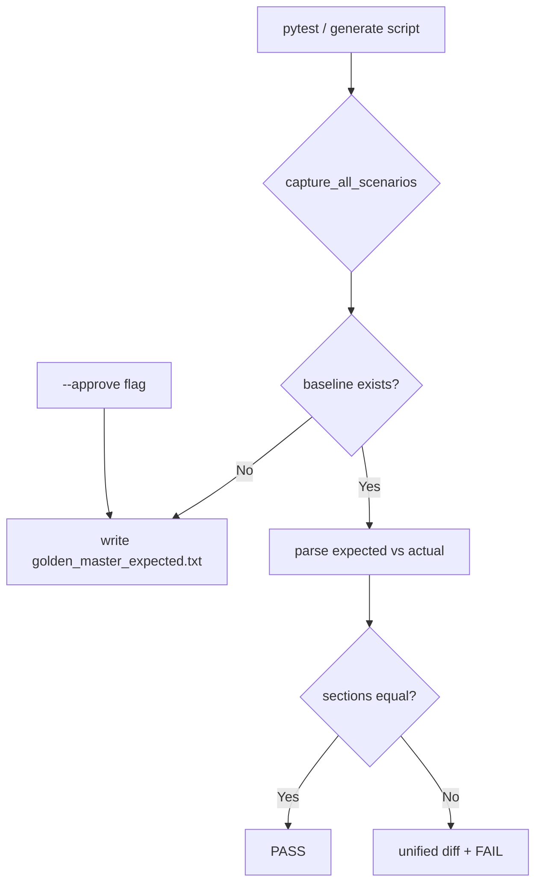

# Golden Master (Approval) Regression — 설계 문서

**프로젝트:** Magic_Square_XX  
**문서 유형:** 회귀 테스트 (Golden Master / Approve 패턴) 설계  
**선행 SSOT:** `Report/02`, `Report/08`, `Report/06` (`SC-DOM-SOL-001`, `SC-BND-VAL-*`)  
**작성일:** 2026-05-29  

---

## 1. 목적

Magic Square Solver의 **관측 가능한 출력**(성공 `int[6]` 또는 오류 코드)을 파일 기준선(baseline)과 비교해, 구현 변경 시 **의도치 않은 출력 drift**를 조기에 탐지한다.

| 항목 | 내용 |
|------|------|
| 기준 파일 | `tests/golden_master_expected.txt` (Git 버전 관리 필수) |
| 실행 | `pytest tests/golden_master/` |
| 갱신 | `python scripts/generate_golden_master.py --approve` |
| 캡처 방식 | Result DTO 직렬화 (`GoldenSuccess` / `GoldenError`) |

---

## 2. Approve 패턴



| 상태 | 동작 |
|------|------|
| 기준 파일 **없음** | `generate_golden_master.py --approve` 또는 `GOLDEN_MASTER_AUTO_CREATE=1 pytest` 시 현재 캡처로 자동 생성 |
| 기준 파일 **있음** | 시나리오별 `Input` + `Output`/`Error` 블록을 문자열 단위로 비교 |
| **불일치** | `difflib.unified_diff` 출력 후 `AssertionError` → pytest FAIL |

### CLI

```bash
# 최초 생성 / 기준 갱신 (의도적 변경 후)
python scripts/generate_golden_master.py --approve

# 기준 존재 시 덮어쓰기 거부 (exit 1)
python scripts/generate_golden_master.py

# 회귀 검증 (마커 필터)
pytest -m golden_master -v
```

---

## 3. 기준 파일 구조

섹션 구분자: `________________________________________`

```
[normal_success]
Input:
16 0 2 0
5 10 11 8
9 6 7 12
4 15 14 1
Output:
[1, 2, 3, 1, 4, 13]

________________________________________

[reverse_success]
Input:
16 2 3 13
5 11 10 8
9 7 0 12
4 14 15 0
Output:
[3, 3, 6, 4, 4, 1]

________________________________________

[invalid_blank_count]
Input:
...
Error:
INVALID_BLANK_COUNT
```

| 필드 | 규칙 |
|------|------|
| `[key]` | `tests/golden_master/scenarios.py`의 `GoldenScenario.key`와 일치 |
| `Input:` | 4행, 공백 구분 정수, 0=빈칸 |
| `Output:` | Python `list[int]` 리터럴 (`repr` 형식) |
| `Error:` | Golden Master 전용 코드 (아래 §5) |

---

## 4. 시나리오 카탈로그

| Key | Test ID | 의미 | SSOT |
|-----|---------|------|------|
| `normal_success` | GM-TC-01 | Step A (small→first blank) 성공 | `SC-DOM-SOL-002` 후보 |
| `reverse_success` | GM-TC-02 | Step A 실패 → Step B (reverse) 성공 | `SC-DOM-SOL-001` |
| `invalid_blank_count` | GM-TC-03 | 빈칸 ≠ 2 | `SC-BND-VAL-001` |
| `duplicate_number` | GM-TC-04 | 비0 중복 | `SC-BND-VAL-002` |
| `no_valid_magic_square` | GM-TC-05 | A·B 모두 실패 | D-SOL-03, UT-08 |

---

## 5. 오류 코드 (Golden Master DTO)

Boundary `UI_ERR_*` / PRD `E00x`와 **별도**로 Golden Master 파일에는 짧은 코드를 사용한다. GREEN 단계에서 Presenter 매핑 테스트(UT-*)와 병행한다.

| Golden code | Report/02 동치 | 검증 순서 |
|-------------|----------------|-----------|
| `INVALID_SIZE` | `UI_ERR_NOT_4X4` | 1 |
| `INVALID_BLANK_COUNT` | `UI_ERR_EMPTY_COUNT` | 2 |
| `INVALID_VALUE_RANGE` | `UI_ERR_VALUE_RANGE` | 3 |
| `DUPLICATE_NUMBER` | `UI_ERR_DUPLICATE` | 4 |
| `NO_VALID_MAGIC_SQUARE` | `UI_ERR_NO_SOLUTION` | 5 |

---

## 6. 모듈 구조

```
tests/golden_master/
├── scenarios.py      # 입력 격자 카탈로그
├── dto.py            # GoldenSuccess / GoldenError 직렬화
├── reference.py      # bootstrap 캡처 (tests/scripts 전용, src/ 미사용)
├── capture.py        # capture_scenario / capture_all_scenarios
├── approve.py        # read / write / diff / assert_golden_master
├── validators.py       # int[6], row-major, Step A/B contract asserts
├── conftest.py
└── test_golden_master_magic_square.py   # GM-TC-01~05 + full document test

scripts/generate_golden_master.py
tests/golden_master_expected.txt   # ← Git tracked baseline
```

### 캡처 경로 전환 (GREEN 로드맵)

현재 `capture.py`는 `reference.py`에 위임한다. FR-01 Boundary GREEN 및 Domain L3 솔버 연결 후:

1. `process_grid_submission` + 실제 `DomainSolverPort` 어댑터 호출
2. `ValidationFailureResult` / `int[6]` → `GoldenError` / `GoldenSuccess` 매핑
3. **기준 파일 형식은 변경하지 않음** — diff만으로 회귀 검증 유지

---

## 7. RG 규칙 정합

| 규칙 | Golden Master 대응 |
|------|-------------------|
| RG-04 | 기준 파일 임의 변경 금지 — solver 수정 후에만 `--approve` |
| RG-01 | assert 완화·skip 대신 diff FAIL |
| ECB | `reference.py`는 `tests/` 전용; entity→boundary 역참조 없음 |

---

## 8. 예시: 불일치 시 출력

```
E       Golden master mismatch (unified diff):
E       --- expected/normal_success
E       +++ actual/normal_success
E       @@ -1,5 +1,5 @@
E        Input:
E        16 0 2 0
E        ...
E        Output:
E       -[1, 2, 3, 1, 4, 13]
E       +[1, 2, 3, 1, 4, 14]
```

---

## 9. 참고 — 요청 예시와 솔버 계약

요청 명세의 `normal_success` 예시 `[3,3,1,4,4,6]`은 **Step A 배치 벡터**이나, 해당 격자에서는 Step A가 마방진을 완성하지 못하고 Step B `[3,3,6,4,4,1]`만 성공한다. 본 Golden Master는 Report/02 **“A 시도 후 B 시도, 첫 성공 반환”** 계약에 따라:

- `normal_success` → A-only 격자, Step A 출력
- `reverse_success` → B-only 격자(요청 예시 입력), Step B 출력

으로 기준선을 고정했다.
